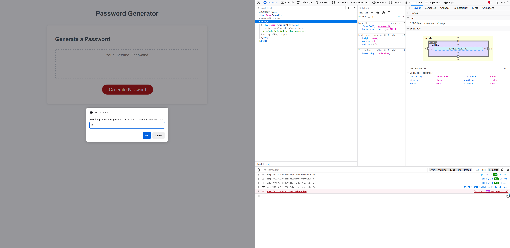

# password-generator-js
# Table of content

[Overview](#Overview)
[Screenshots](#Screenshots)
[Links](#Links)
[My_process](#My_process)
[Built_with](#Built_with)
[What_I_learned](#What_I_learned)
[Continued_developement](#Continued_developement)
[Author](#Author)
[Sources](#Sources)

# Overview
This is the second solution of the 5th week challange, called Password Generator. I recreated the challange to practice using Javascript functions, etc. 

## Screenshots

Password Gerenator screenshot 
[generated 20 char password](./assets/img/generated20charPW.png)
[alert message if one of requirements is missing](./assets/img/alert-msg-user-missed-sg.png)

### Links
Password Generator on github[https://github.com/hszilvi/password-generator-js]
live link[]

## My_process
At first I wrote the pseucodes to create a "to do" list before create the code.
Using thsese pseucodes I created the functions.
Later I made the code shorter as I revisioned my code.
After testing the code, I find bugs, so I added extra code lines like reset function to the code.

I wrote the readme.md with the relative path to screen shot and links and other expected contents. 

### Built_with
Javascript, VS code

## What_I_learned
I learned a lot about Javascript functions. 

### Continued_developement
- deeper understanding of functions

## Author
Szilvia Horvath
GitHub[https://github.com/hszilvi]
LinkedIn[https://www.linkedin.com/in/horvathszilvi/]

# Sources
Special thanks to my TA, Martin William
https://dmitripavlutin.com/javascript-merge-arrays/
https://dev.to/gaelgthomas/array-to-string-without-commas-in-javascript-4mg6
https://dev.to/code_mystery/random-password-generator-using-javascript-6a
https://codepen.io/FlorinPop17/pen/BaBePej
https://www.youtube.com/watch?v=q-O1n445uys